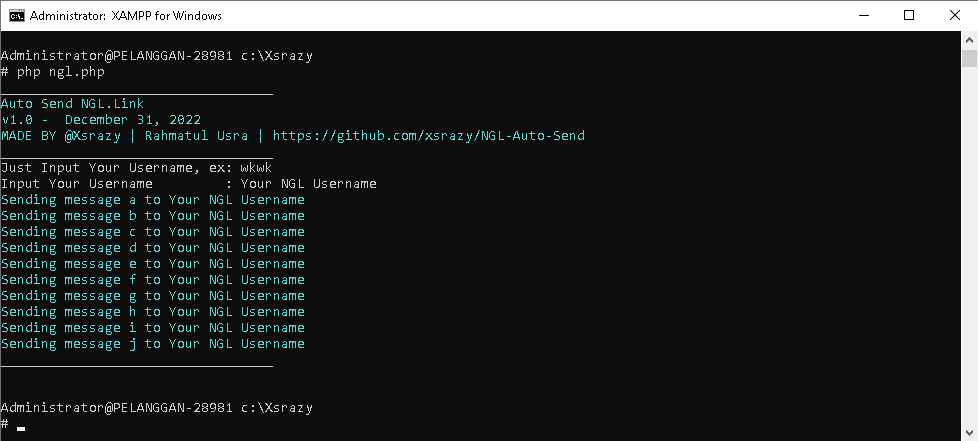

 

## How to install (DEFAULT or BASIC USAGE)
* git clone https://github.com/xsrazy/NGL-Auto-Send
* cd NGL-Auto-Send
* ls
* Edit your message in msg.txt
* php ngl.php
 

## For PC/Laptop ONLY:
* Download GIT for Windows (https://git-scm.com/download/) *Choose WIN & 32bit/64bit
* Download Xampp (https://www.apachefriends.org/download.html) *Choose 32bit/64bit
* INSTALL GIT for Windows & Xampp
* Download File on Github (https://github.com/xsrazy/NGL-Auto-Send)
* Extract File NGL-Auto-Send and enter the folder
* Right Click on Mouse, Then Select "Git Bash Here" (Make sure you are in the NGL-Auto-Send folder!!!)
* To View The Contents Of a folder in bash, type: "ls" (without "")
* Edit your message in msg.txt
* php ngl.php
 

## For TERMUX ONLY:
* Install Termux (PlayStore)
* Open Termux and Wait for Automatic Install of Termux.
* pkg install git
* pkg install php
* git clone https://github.com/xsrazy/NGL-Auto-Send
* cd NGL-Auto-Send
* ls
* Edit your message in msg.txt
* php ngl.php
	
 

